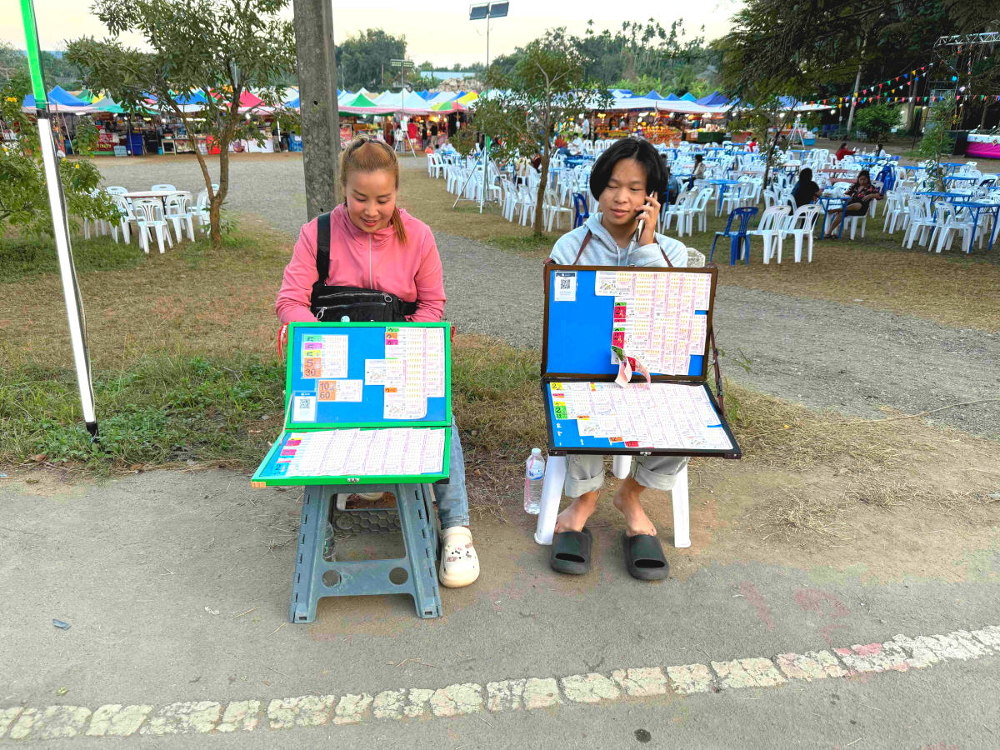

# 20241227_chiangrai

<html>
<head>

<meta charset="UTF-8">
<meta http-equiv="Content-Type" content="text/html; charset=UTF-8">
<meta http-equiv="X-UA-Compatible" content="IE=EmulateIE10" />
<meta http-equiv="X-UA-Compatible" content="IE=edge">

<!--ここから上はお決まりの定型文です-->

<!--ここからが表現の書式などを決めるcssという部分-->

<link href="https://cdnjs.cloudflare.com/ajax/libs/lightbox2/2.7.1/css/lightbox.css" rel="stylesheet">

</head>

<body>

モバイル端末をお使いの場合は、画面を横向きにすると
より見やすくご覧頂けます。

<!--ここ上は、ほぼそのまま使います！-->

<!--QRコードの挿入例-->

 アクセス用QRコード

<marquee direction="left" scrollamount="20" width="30%">(^_^)/~alis</marquee>

<!--流れ文字の挿入例-->
<h1><marquee behavior="left">!!! 2024/12/27 、メーチャンから北上したところにある植物園で観光 !!!</marquee></h1>

                          

<!--ここから下が、本体部分-->

<h2>今回の植物園はこの辺り、洞窟と表示されていますが、洞窟には誰も入りません 画像のクリックでGoogleMapsに飛びます</h2>

<h2>久しぶりに観光地っぽいところを訪問 車を止めてまず目に入ったのはこの建物</h2>

<h2>横にもこんな建物</h2>

<h2>最初の建物の外階段を登ると2階部分</h2>

<h2>2階部分からの眺め</h2>

<h2>2階部分の扉の中は仏教施設、誰もいません（皆興味なし？）</h2>

<h2>施設は入場料も駐車料金も無料、駐車場係のおじさんはたくさん居ました</h2>

<h2>お金がかかるのは屋台での買い物がメイン</h2>

<h2>
<a href="https://torokoid.github.io/20241126_chiangrai/" target="_blank">Back to the menu page</a>
</h2>

   

   

         

  

      

<!--本体はここまで-->

<!--画面に空白地帯を作って、背景が見えるようにしています-->
                                              

<!-- フッタ -->
<footer>

Copyright 2024/12/28 alis @ChiangRai

</footer>

<!--HPにさまざまなJavaScriptを呼び込むための書式-->

